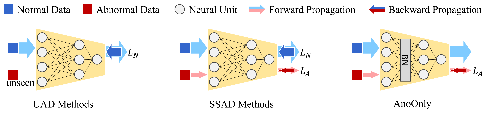

# AnoOnly
The official implementation of "AnoOnly: Semi-Supervised Anomaly Detection without Loss on Normal Data".

## Abstract
Semi-supervised anomaly detection (SSAD) methods have demonstrated their effectiveness in enhancing unsupervised anomaly detection (UAD) by leveraging few-shot but instructive abnormal instances. However, the dominance of homogeneous normal data over anomalies biases the SSAD models against effectively perceiving anomalies. To address this issue and achieve balanced supervision between heavily imbalanced normal and abnormal data, we develop a novel framework called *AnoOnly* (**Ano**maly **Only**). Unlike existing SSAD methods that resort to strict loss supervision, AnoOnly suspends it and introduces a form of weak supervision for normal data. This weak supervision is instantiated through the utilization of batch normalization, which implicitly performs cluster learning on normal data. When integrated into existing SSAD methods, the proposed AnoOnly demonstrates remarkable performance enhancements across various models and datasets, achieving new state-of-the-art performance. Additionally, our AnoOnly is natively robust to label noise when suffering from data contamination.



## Enviroment
- PyTorch 

## train
```shell
python scripts run.py \
    --baseline ${BASELINE NAME} \
    --anomaly_only
```

## Overall AUCROC (%) on 10 datasets (5 CV datasets and 5 NLP datasets).
| Methods | DeepSAD | +AnoOnly | FEAWAD | +AnoOnly | PReNet | +AnoOnly | DevNet | +AnoOnly |
| ------- | ------- | -------- | ------ | -------- | ------ | -------- | ------ | -------- |
| AUCROC  | 67.80   | **86.30**    | 81.50  | **85.00**    | 84.20  | **86.70**    | 85.60  | **88.00**    |

## Thanks to

- [ADBench](https://github.com/Minqi824/ADBench)